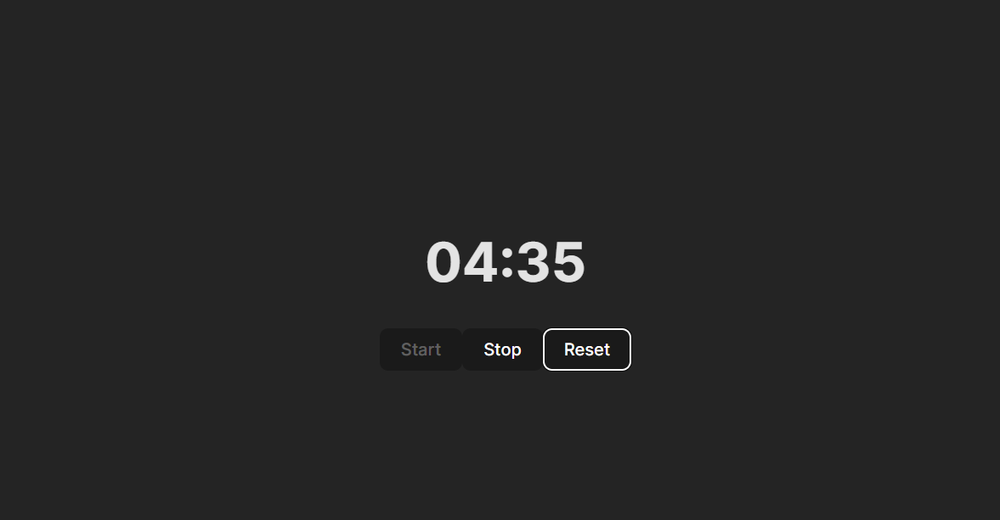

# Timer Application = React + TypeScript

This small timer application runs using vite

Running the application doing:
```ts
   npm run start
```

And this is the expected behaviour of the application:

- When the page is first loaded, the counter displays 5 minutes (i.e. `5:00`)
- When the user clicks `Start`, the counter starts counting down.
- When the user clicks `Stop`, the timer should start elapsing time.
- When the user clicks `Reset`, the timer should be reset to 5 minutes again

